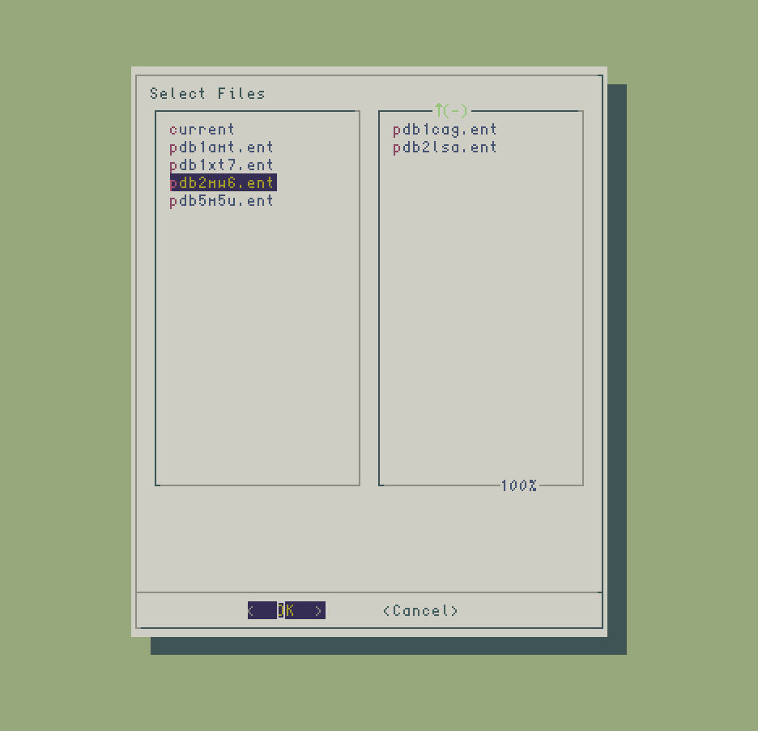

# GRABB

<p align=center>

<p/>

---

`grabb` is a simple `BASH` script that uses linux `dialog` to assemble a file list for
piping into other programs. It may be supplied with an optional argument
for glob-style filtering when populating the directory column. 
The benefit is that files may be quickly and visually selected or excluded rather than 
using command line regex. It may easily be used in other scripts with
command substitution. 

### Example Usage

```
>_ ls
f1.txt	f2.txt	f3.txt	f4.log	f5.log	
>_ echo "$(grabb .txt)" | sed 's/txt/log/g'
f1.log	f2.log	f3.log	f4.log	f5.log
```	
